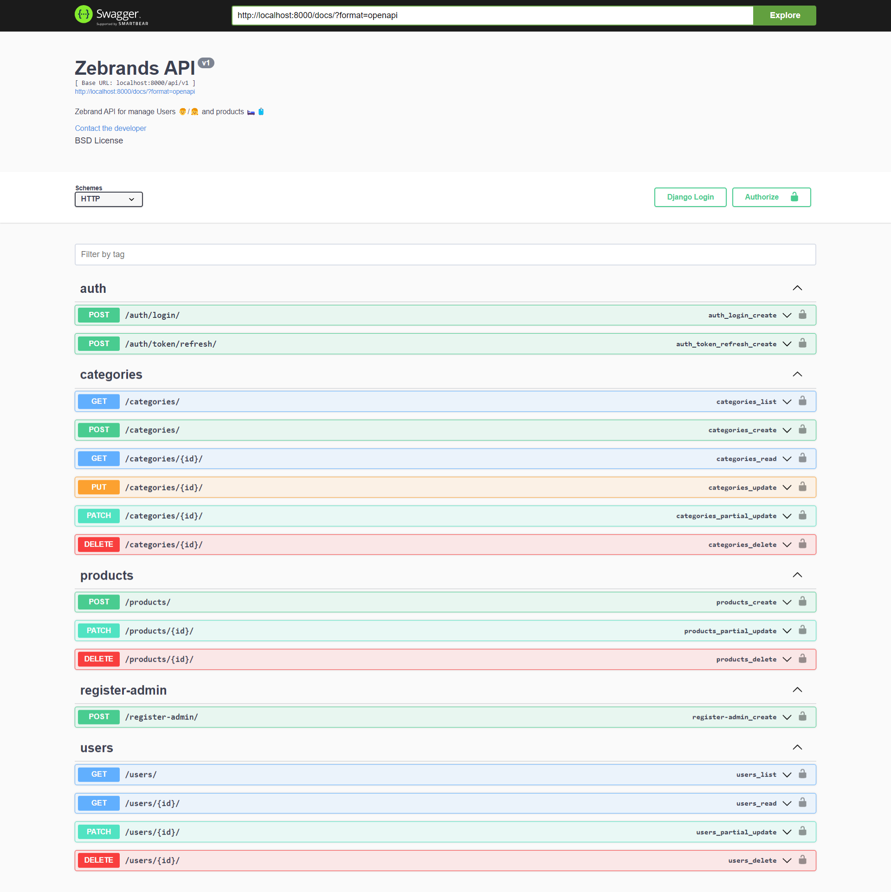
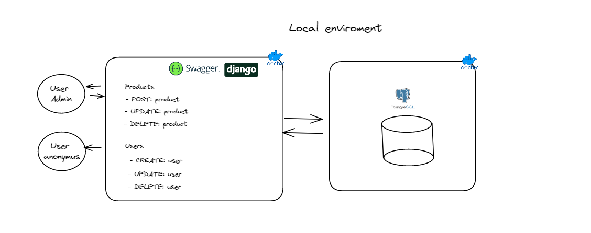
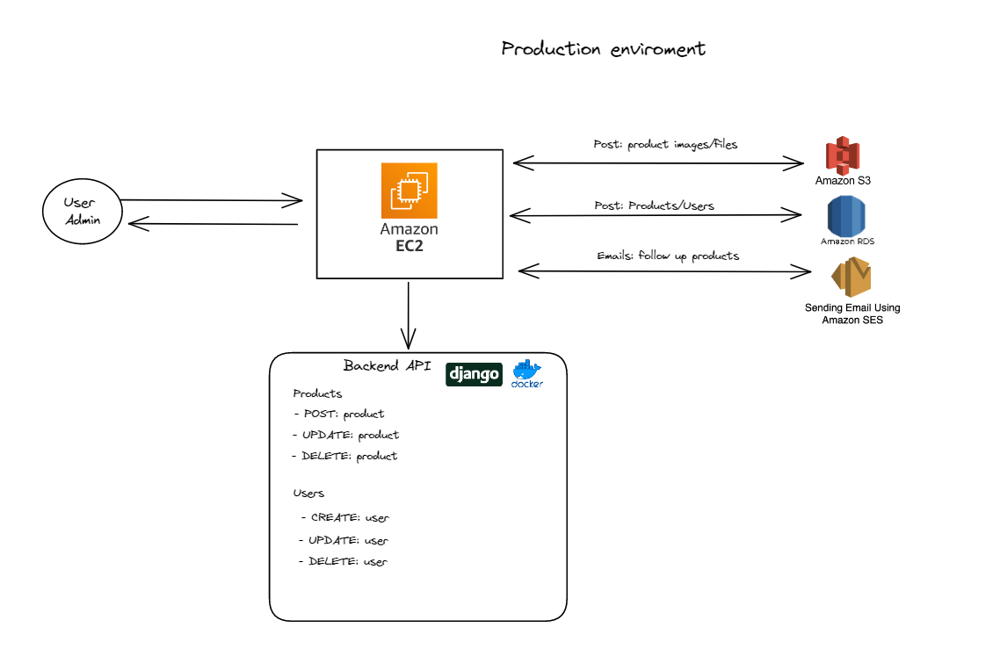
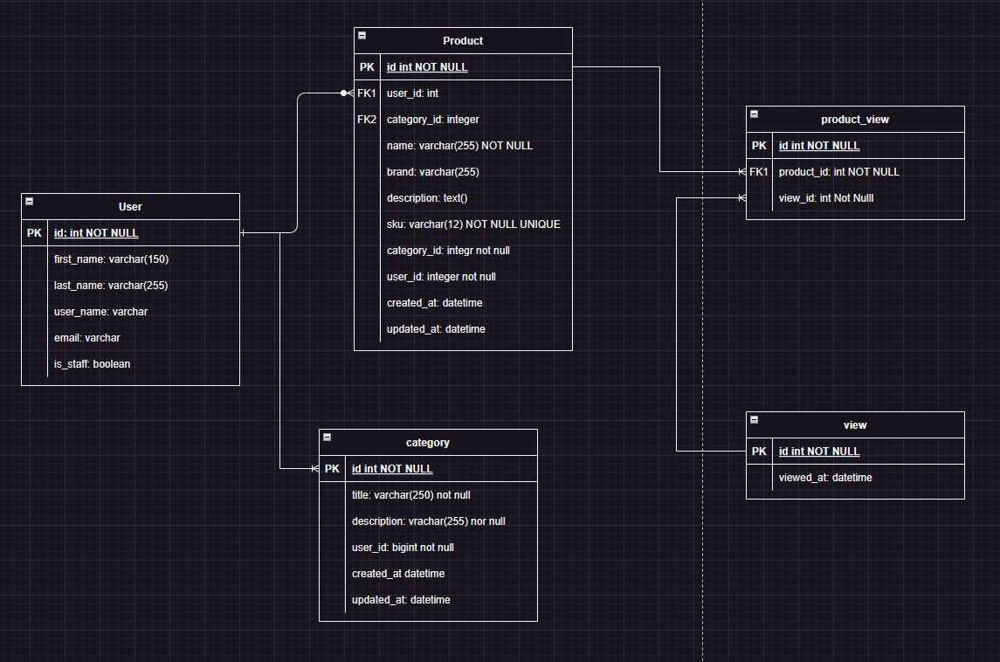

<h1 align="center" id="title">  Zebrands API 🚀</h1>

🧳🛏️ API for mange users and product inside Zebrands

## Table of Contents
- [Table of Contents](#table-of-contents)
- [🚀 Demo](#-demo)
- [System Design 🔬](#system-design-)
  - [Local enviroment](#local-enviroment)
  - [Production Enviroment](#production-enviroment)
- [Entity-Relationship Diagram](#entity-relationship-diagram)
- [💡Features](#features)
- [🧑‍💻 Installation Steps](#-installation-steps)
- [Licence](#licence)
- [Author](#author)

## 🚀 Demo

## System Design 🔬
### Local enviroment

For the local enviroment the proposal is creating a dockerfile and docker-compose.yml for manage the services like the API and the database usign django and PostgreSQL.

### Production Enviroment
The architecture proposal for increase the services into a production enviroment is add 2 diferent services more that Amazon SES in which include:

**Amazon S3:** I would implement Amazon S3 for manage the images o any file in the sistem, allowing to create a stateless backend if we have the necesity the scale the instance using Kubernetes to admin tis instance we are going to be able to scale horizontal this instance without the need to replicate all product images to each new instance created, which would not scale.

**Amazon RDS:** I we manage a lot information we need to host it in a cloud relationship database system, which will allow me to grow my databases according to the volume of users that connect.

## Entity-Relationship Diagram

In order to see the application I created my own relationship model, identifying a one-to-many relationship between user and products.

I decided to implement a category table asociate with products and user using a one-to-many relationship in which every product needs to be into a category and the admins can create the categories.

**Why a table View?**

If a anonymus user is going to be able to check the products, the main idea is when a user that is not authenticated cheack a product this is going to create a register in the table product_view that is manage for django using many-to-many relationship.

In the future we create a report where are going to be able to consult over products how many time is repeated into the product_view and filtering by periods of time chech which produc was consultin more times.

## 💡Features
Here're some of the projects's best features:
- Create, update and delete admins ✅
- Implement Swagger documentation ✅
- Implement JWT for manage authentication ✅
- Endpoints for crud categories ✅
- Endpoints for create, delete and update products ✅

## 🧑‍💻 Installation Steps
1. Clone the repository
2. Install requirements in your virtual enviroment `pip install -r requirements.txt`
3. Create the env file in the root of the project `.env` and copy the content of the `.env.example` to configurate environment variables.
5. You can run the following command to buil the image. `$ docker-compose build`
6. Once the image is built, run the container: `$ docker-compose up -d`
7. Run the migrations with `docker-compose run app sh -c "python manage.py migrate`
8. Create a superuser with the command `docker-compose run app sh -c "python manage.py createsuperuser`
8. Now go to http://127.0.0.1:8000/docs and enjoy the app.

## Licence
> This project is licensed under the MIT License

## Author
Made with 💙 by [javieramayapat](https://www.linkedin.com/in/javieramayapat/)