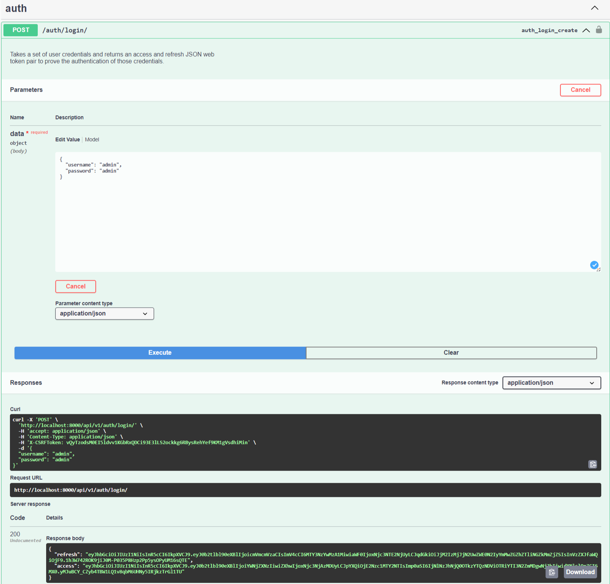
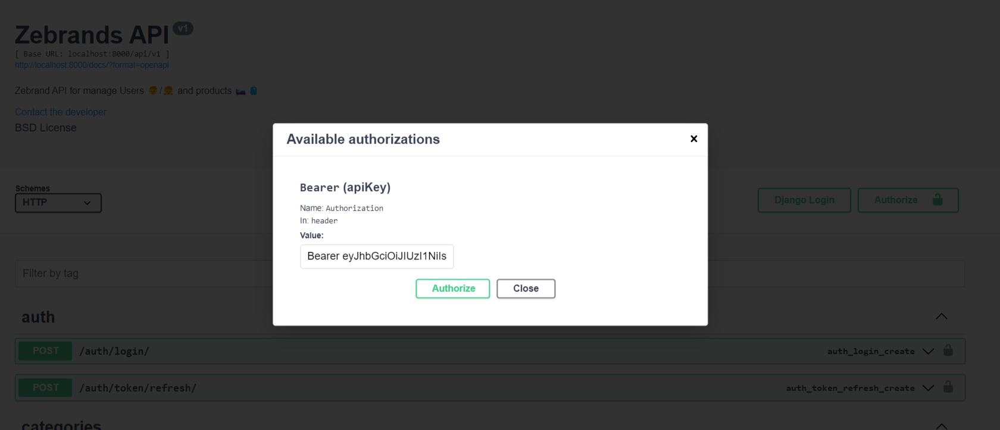
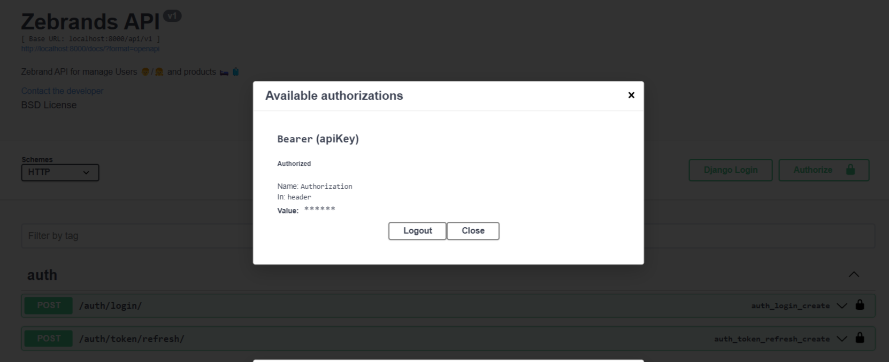

<h1 align="center" id="title"> 🛍️ Zebrands API 🛍️</h1>

Zebrands API manages product, user and category management for a retail company 🛏️🧳

## Table of Contents
- [Table of Contents](#table-of-contents)
- [💡Features](#features)
  - [Extra Features](#extra-features)
- [🚀 System Design](#-system-design)
  - [🏠 Local enviroment](#-local-enviroment)
  - [🌐 Production Enviroment](#-production-enviroment)
- [🧑‍💻 Installation Steps](#-installation-steps)
  - [🔓 How to test the API using Token Authorization](#-how-to-test-the-api-using-token-authorization)
  - [🚀 Demo](#-demo)
- [Licence](#licence)
- [👨‍💻Author](#author)

## 💡Features
Here're some of the projects's best features:
- Products 🛒
  - Create, update and delete Products
  - List all Products of the zebrands catalog.
  - Search by product filtering by sku
  - Counting anonymous user views for future reports.

- Users 💁‍♀️💁‍♂️
  - Create, update and delete Users(admins).
  - List of administrator users restricted to administrator users.

- Categories 🛍️
  - Complete CRUD to manage product categories.
  
- ⚠️ Send emails using AWS SES 📨
  - This feature is limitated by AWS free tier.
  - What did I do to solution:
  I created a valid Gmail that you can use for creating a new admin into the API, This Gmail account has the email verified into AWS SES, this allows you to edit products by SKU and send a notification for all admins into the platform only if their emails are verified.
  - Credentials:
     - gmail: zebrands.test@gmail.com
     - password: zebrandsadmin
  - 

### Extra Features
- Use of container technology (Docker) to package code ✅
- Deploy into AWS EC2 Instance ✅
- Implement JWT for manage authentication ✅
- Implement Swagger documentation ✅
- Implement Pagination to GET endpoints in Users, Products and categories ✅

## 🎯 Entity-Relationship Diagram

In order to see the application, I created my own relationship model, identifying a one-to-many relationship between user and products.

I decided to implement a category table associate with products and user using a one-to-many relationship in which every product needs to be into a category and the admins can create the categories.

**Why a pivot table - View?**

This table is used to store all the time a product is requested by an anonymous user, to manage this I use a many-to-many relationship between products and views.

If we need a report of the products we can take advantage of the query power of django to make a filter for all the times that a product appears in this table.

## 🚀 System Design
### 🏠 Local enviroment

For a local enviroment I package the project using techonolgies like:
- Docker 🐋
- Docker compose 🐳

The idea is create an isole enviroment in which can separate the seervices like th app and the database and connect them in a easy way through enviroment variables and be ready for deploy.

### 🌐 Production Enviroment
If we want to scale this architecture we can implement the following steps:
1. Manage an orchestration-based architecture
2. Manage a stateless type architecture
   1. Enable new instances to be added
   2. It will allow for better scaling of applications
3. Use cloud tools such as RDS and S3 for information management.

**Amazon S3:** An example of following a stateless architecture that we can implement in our API is the storage outside the django backend instance.

By delegating this storage to an S3 bucket our instance does not store any files and instead points to the same bucket, which will allow it to scale easily.

I would implement Amazon S3 for manage the images o any file in the sistem, allowing to create a stateless backend if we have the necesity the scale the instance using Kubernetes to admin tis instance we are going to be able to scale horizontal this instance without the need to replicate all product images to each new instance created, which would not scale.

**Amazon RDS:** For manage a lot information we need to host it in a cloud relationship database system, which will allow us to grow my databases according to the volume of users and products that we store.

## 🧑‍💻 Installation Steps
1. Clone the repository  `git clone git@github.com:javieramayapat/zebrands-api.git`
2. Create the env file in the root of the project `.env` and copy the content of the `.env.example` to configurate environment variables.
3. You can run the following command to buil the image. `$ docker-compose build`
4. Once the image is built, run the container: `$ docker-compose up -d`
5. Run the migrations with `docker-compose run app sh -c "python manage.py migrate`
6. Create a superuser with the command `docker-compose run app sh -c "python manage.py createsuperuser`
7. Now go to http://127.0.0.1:8000/docs and enjoy the app.

### 🔓 How to test the API using Token Authorization
To use the API endpoint you need to be authenticated

1. Authenticated with your credential into `auth/login/` endpoint with your username and password to get your token and request information from the API.

2. Copy you your `access token`

3. Use the `Authorize button` at the top of the documentation, in the value field add the prefix `Bearer` + `your_token` with a space in between for proper authentication.

4. Apply the authorization and start playing with the API which is the fun part of it 🚀.

### 🚀 Demo

## Licence
> This project is licensed under the MIT License

## 👨‍💻Author
Made with 💙 by [javieramayapat](https://www.linkedin.com/in/javieramayapat/)
