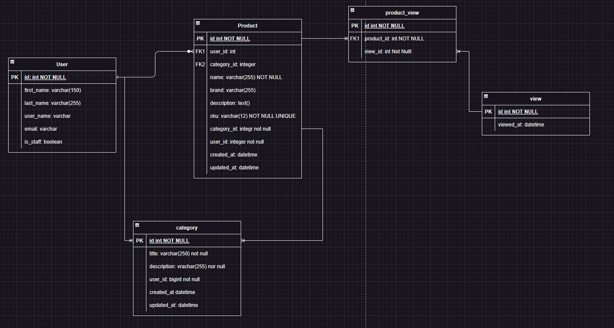

<h1 align="center" id="title"> 🛍️ Zebrands API 🛍️</h1>

Zebrands API manages product, user and category management for a retail company 🛏️🧳

## Table of Contents
- [Table of Contents](#table-of-contents)
- [💡Features](#features)
- [Entity-Relationship Diagram](#entity-relationship-diagram)
- [System Design 🚀](#system-design-)
  - [Local enviroment](#local-enviroment)
  - [Production Enviroment](#production-enviroment)
- [🧑‍💻 Installation Steps](#-installation-steps)
- [🚀 Demo](#-demo)
- [Licence](#licence)
- [Author](#author)

## 💡Features
Here're some of the projects's best features:
- Endpoints for create, delete and update products ✅
- Create, update and delete admins ✅
- Endpoints for crud categories ✅
- Use of container technology (Docker) to package code✅
- Implement JWT for manage authentication ✅
- Implement Swagger documentation ✅

## Entity-Relationship Diagram

In order to see the application I created my own relationship model, identifying a one-to-many relationship between user and products.

I decided to implement a category table asociate with products and user using a one-to-many relationship in which every product needs to be into a category and the admins can create the categories.

**Why a pivot table - View?**

This table is used to store all the time a product is requested by an anonimus user, to manage this I use a many-to-many relationship beetween products and views.

If we need a report of the products we can take advantage of the query power of django to make a filter for all the times that a product appears in this table.

## System Design 🚀
### Local enviroment

For a local enviroment I package the project using techonolgies like:
- Docker 🐋
- Docker compose 🐳

The idea is create an isole enviroment in which can separate the seervices like th app and the database and connect them in a easy way through enviroment variables and be ready for deploy.

### Production Enviroment
If we want to scale this architecture we can implement the following steps:
1. Manage an orchestration-based architecture
2. Manage a stateless type architecture
   1. Enable new instances to be added
   2. It will allow for better scaling of applications
3. Use cloud tools such as RDS and S3 for information management.

**Amazon S3:** An example of following a stateless architecture that we can implement in our API is the storage outside the django backend instance.

By delegating this storage to an S3 bucket our instance does not store any files and instead points to the same bucket, which will allow it to scale easily.

I would implement Amazon S3 for manage the images o any file in the sistem, allowing to create a stateless backend if we have the necesity the scale the instance using Kubernetes to admin tis instance we are going to be able to scale horizontal this instance without the need to replicate all product images to each new instance created, which would not scale.

**Amazon RDS:** For manage a lot information we need to host it in a cloud relationship database system, which will allow us to grow my databases according to the volume of users and products that we store.

## 🧑‍💻 Installation Steps
1. Clone the repository  `git clone git@github.com:javieramayapat/zebrands-api.git`
2. Create the env file in the root of the project `.env` and copy the content of the `.env.example` to configurate environment variables.
3. You can run the following command to buil the image. `$ docker-compose build`
4. Once the image is built, run the container: `$ docker-compose up -d`
5. Run the migrations with `docker-compose run app sh -c "python manage.py migrate`
6. Create a superuser with the command `docker-compose run app sh -c "python manage.py createsuperuser`
7. Now go to http://127.0.0.1:8000/docs and enjoy the app.

## 🚀 Demo

## Licence
> This project is licensed under the MIT License

## Author
Made with 💙 by [javieramayapat](https://www.linkedin.com/in/javieramayapat/)